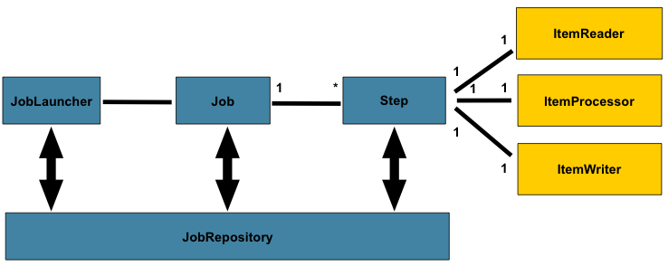

## Sistemas Batch

Sistema que roda em segundo plano, ```SLA``` (short live applications), normalmente processando uma grande quantidade de dados, também chamado de sstemas de processamento em lote. Já foi muito utilizado no passado em solução ```Mainframe``` com ```Cobol```. Alguns exemplos de sistemas batch, são:

- Pagamento da folha dos funcionarios;
- Disparo de e-mails;
- Envio de notificações
- Migração, ETLs e sincronização de base de dados;


## Sistemas Batch x Sistemas web

- Disponibilidade dos dados;
- Volumetria dos dados;
- Não tem interação com front-end;


## O que é o Spring Batch?


O Spring Batch é framework (assim como o Spring Boot ou Spring Data), criado para prover funções reutilizaveis que são essenciais para o processamento em lote como: logs, rastreamento, estastisticas e metadados dos jobs, gerenciador de transações, manipulação de jobs. Além disso, o Spring Batch prove tecnicas avançadas de processamento com alto volume de dados e para alta performance atráves de otimizaçoes de particionamento;

- Gerenciamento de transações para banco de dados;
- Processamento baseado em Chunks;
- Componentes para Input e Output;
- Start/Stop/Restart/Retry/Skip;
- Interface Web administrativa (Spring Cloud Data Flow)




## Componentes do Spring Batch

### Jobs

O ```Job``` é o componente mais alto nível, representa normalmente uma tarefa completa e independente, dentro do Job, pode ter varios componentes menores que chamamos de Steps. Cada Job tem um ```JobInstance```, que representa uma instancia de um Job e um ```JobExecution``` que representa a execução de uma instancia e o ```JobLauncher``` responsavel por lançar uma nova JobInstance. Por fim existe o ```JobRepository```, componente responsavel por fazer a integração dos metadados dos jobs, execuções para o banco de dados.


### Steps

O ```Step``` é uma unidade fundamental do ```Job``` é o responsavel pela execução de uma tarefa dentro do ```Job```. Cada ```Step``` tem um objetivo bem claro e definido. Cada ```Step``` tem um ```StepExecution``` associado a uma dada execução.

### Tasklets x Chunklets

A ```Tasklet``` é um estratégia simples de implementação de um ```Step```. A ```Tasklet``` é muito utilizado para pre-processamentos, validaçoes, capturas de arquivos externos, criação ou limpezas de diretorios ou implementaçoes customizadas de I/O.

O **Chunklet** é uma estratégia de implementatação mais robusta que tem por padrão tres outros componentes associados: ```ItemReader```, ```ItemProcessor``` e ```ItemWriter```.
- O ```ItemReader``` é uma abstração de como os dados são fornecidos como entrada para um Step. 
- O ```ItemProcessor``` representa o tratamento, filtragem e transformação dos dados para a gravação.
- O ```ItemWriter``` é o produto ou saída de um ```Step```. Utilizado para a escrita em lote dos dados.

Um parametro muito importante na implementação de um Chunklet é o ```ChunkSize```, ou numero de "pedaços", essa informação é utilizada para saber a quantidade de transações e escritas. Exemplo, suponha que eu defina um chuckSize de 100, nesse caso o Spring Batch irá ler e processar os primeiros 100 regitros e logo em sequencia irá gravar em lote os 100 registros. Esse processo irá se repetir até a finalização de todos os registros da fonte de dados de 100 em 100. Normalmente quanto maior esse número mais rápido é o processamento da aplicação batch, pois terá menos conexões IO de saída, porém será menos tolerante a falhas, pois quando ocorre um erro leitura ou processamento esse chunk é descartado por completo caso não tenha nenhuma tratativa. 


### ItemReader

Embora seja um conceito simples, um ```ItemReader``` é o meio para fornecer dados de muitos tipos diferentes de entrada. Os exemplos mais gerais incluem:

- Arquivo Simples: Leitores de itens de arquivo simples, os registros podem ser separados por algum caracter especial. ex.: CSV;
   - ```FlatFileItemReader```
   - ```SynchronizedItemStreamReader```

- XML: XML ItemReaders processam XML independentemente das tecnologias usadas para análise, mapeamento e validação de objetos. Os dados de entrada permitem a validação de um arquivo XML em relação a um esquema XSD.
   - ```StaxEventItemReader```

- Banco de dados: um recurso de banco de dados é acessado para retornar conjuntos de resultados que podem ser mapeados para objetos para processamento.
   - ```MongoItemReader```
   - ```RepositoryItemReader```


```
public interface ItemReader<T> {
    T read() throws Exception, UnexpectedInputException, ParseException, NonTransientResourceException;
}
```

### ItemWriter


```ItemWriter``` é semelhante em funcionalidade a um ```ItemReader```, mas com operações inversas. Os recursos ainda precisam ser localizados, abertos e fechados, mas diferem porque um ```ItemWriter``` grava, em vez de ler. No caso de bancos de dados ou filas, essas operações podem ser inserções, atualizações ou envios. O formato da serialização da saída é específico para cada trabalho em lote.

Assim como ```ItemReader```, ```ItemWriter``` é uma interface bastante genérica, conforme mostrado na seguinte definição de interface:

```
public interface ItemWriter<T> {

    void write(Chunk<? extends T> items) throws Exception;

}
```

Algumas das implentações existentes:

- ```SynchronizedItemStreamWriter```: Utilizado para ambientes thread safe;
- ```JmsItemWriter```: Envio de um evento para uma fila JMS;
- ```KafkaItemWriter```: Envio de uma mensagem para um tópico no Apache Kafka
- ```MongoItemWriter```: Para armazenamento no banco de dados MongoDB;
- ```JpaItemWriter```: Utiliza um JPA EntityManagerFactory para mesclar quaisquer entidades que não fazem parte do contexto de persistência


### ItemProcessor

Um ```ItemProcessor``` é simples. Dado um objeto, transforme-o e retorne outro. O objeto fornecido pode ou não ser do mesmo tipo. A questão é que a lógica de negócios pode ser aplicada dentro do processo, e cabe inteiramente ao desenvolvedor criar essa lógica.

```
public interface ItemProcessor<I, O> {

    O process(I item) throws Exception;
}
```

## Algumas Vantagens

 - **Tratamento a falhas**: É possivel por meio dos metadados localizar o chunck que ocorreu a falha e restartar a execução a partir desse ponto;
- **Monitoramento e Métricas**: Configurados informações do Step como: quantidade de items lidos, processados e gravados;
 - **Ambiente Multithread**: É possivel utilizar uma abordagem multithread, que já irá cuidar do thread pool, gerenciamento de alocação de threads. Por meio do framework também é possivel definir o numero maximo de threads e outros parametros relevantes. 
 - **Paralelizar Steps**: Caso o retorno de um step não dependa do outro também é possivel paralelizar a execução deles;
  - **Particionar Steps**: É possivel também utilizar a abordagem de works e master afim de otimizar o tempo de execução de um Step;
   - **Remote Chuncking e Remote Partitioning**: Solução utilizando processado clusterizado;


## Bibliografia

- Documentação Oficial (https://spring.io/projects/spring-batch)
- Video Julia Bezerra - Overview Sobre Spring Batch (https://www.youtube.com/watch?v=ACaKKm00Tts)


